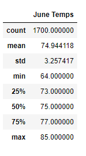
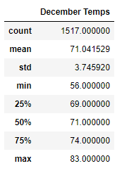
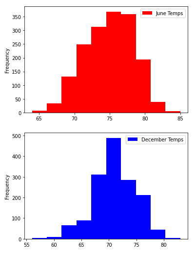

# Surfs Up1
Using Jupyter notebook, SQLalchemy, Pandas, Python, and Matplotlib to summarize temperature readings and compare Oahu temperatures in the months of June and December. 

## Overview

The purpose of this analysis is to analyze Oaho, Hawaii temperature readings over several years in order to see if Oahu is a good location for surfing and ice cream businesses. Hawaii temperature data was pulled from a SQLite database using SQLalchemy to read the data into pandas DataFrames for further statistical analysis. 

## Results

- On initial glance at the summary statistics results, the temperatures in June and December do not show a very large difference. The average temperature only dropped 3.9°F between June and December in which the average temperature is still quite warm at 71.0. 

- The min temperature for June is 64°F, while the min temperature in December is 56°F, which shows a bigger drop than the average temperature. However, a minimum temperature of 56 is still quite a bit higher than freezing. Meanwhile, the max temperatures only show 2° difference between June's max temp of 85°F and the December max temp of 83°F, which is pretty hot!

- Both sets of data for June and December appear to have good central tendency, meaning the mean is close to the median of each month's temperatures. The median for June is only 0.06° above the mean and the median for December is only 0.04 less than the mean, both very small differences. This means that the data showing is very typical, or consistent. Also, since this data shows multiple years of temperatures all together, we can be confident in these weather patterns continuing in the future. 

## Summary

In conclusion from comparing the June and December temperatures over multiple years in Oahu, the weather seems ideal for a business centered around surfing and ice cream. The high temperatures are in the low to mid 80s for both months, showing that there are hot days all year round on Oahu. Also, the average temperature is in the 70s for both months, which speaks to a climate that is generally warm all year round. 

### Additional queries for further analysis
- Creating histogram charts of the temperature frequencies during the months of June and July will allow us to better see how often the temperatures occur during the month. This allows us to visualize the overall warmer temperatures in June because the bars/bins closest to the median (70°) are higher than the lowest and highest temps. The charts also show that the lowest temperatures in December happen much less frequently, while the mean/median temperature of ~71° occurred 500 times in the data sample, which is significantly higher frequency than the other temperatures in December. 

- Another option for further analysis would be to further split up the data into groups by year to view trends per month over several years. This will allow us to check for outlier data as well, perhaps there was one year that was particularly cold or hot which caused outliers and skewed the data. It would be helpful to visualize the charts together using different colors for the different months' data and looking at a timeline on the x=axis. 

